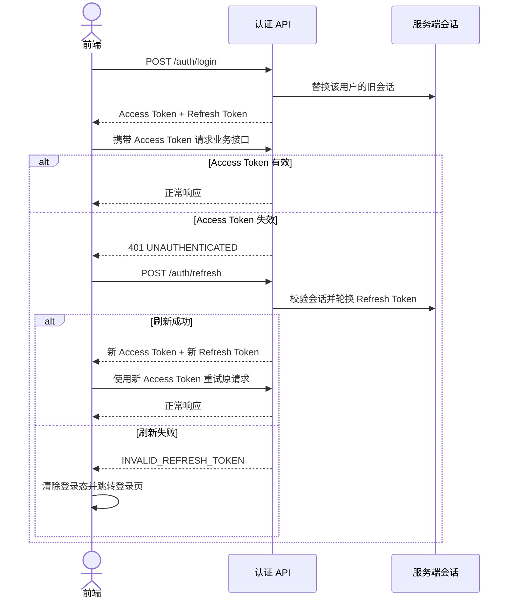
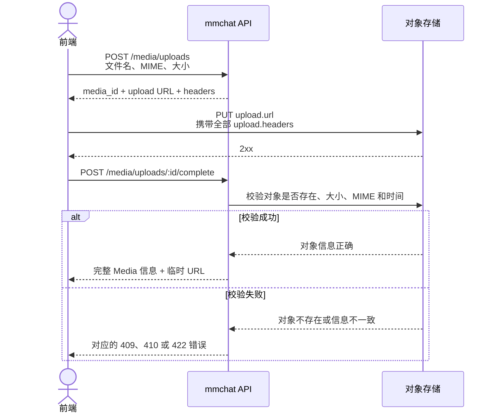
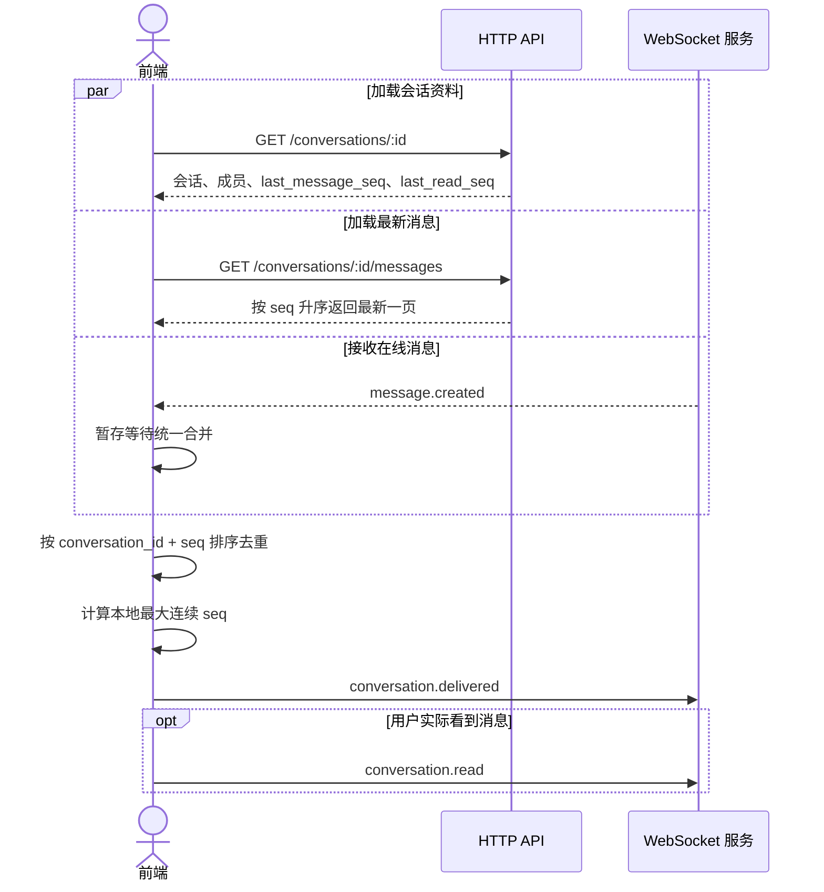
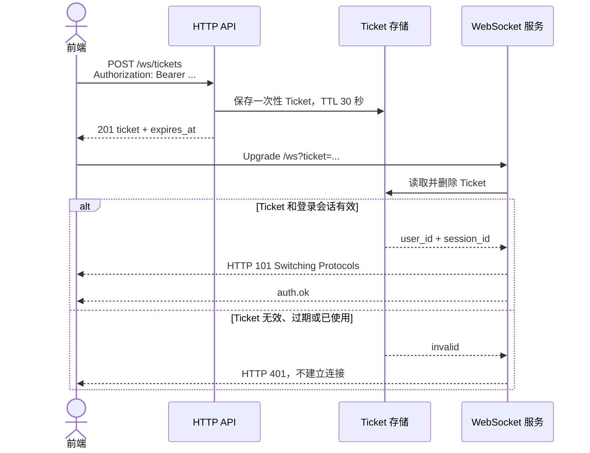
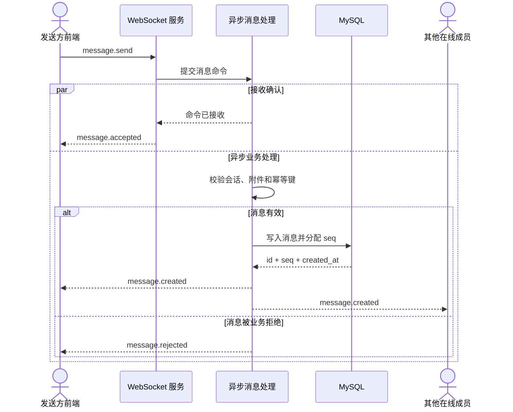
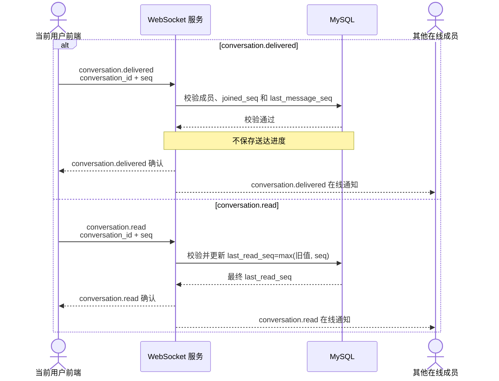
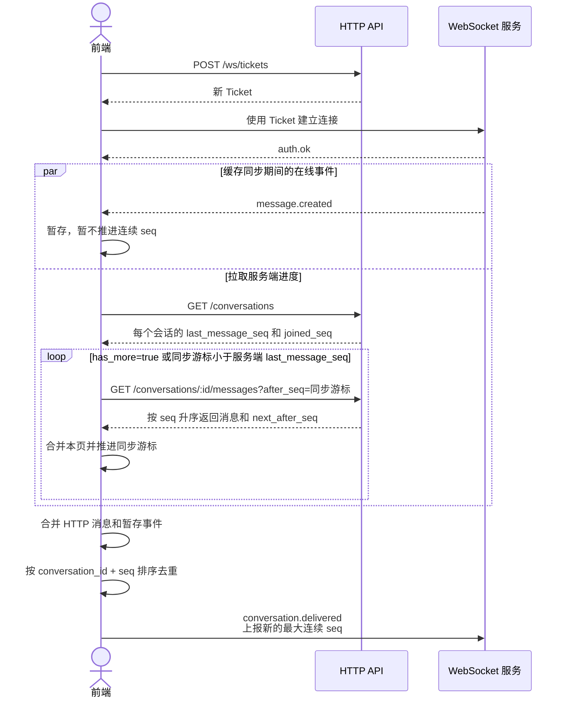

# mmchat API 文档

更新时间：2026-08-31

API 前缀：`/api/v1`

## 前端接入总览

本文只描述当前已经实现的接口和协议。前端建议按以下顺序接入：

| 顺序 | 功能点 | HTTP 接口或 WebSocket 事件 | 完成标准 |
| --- | --- | --- | --- |
| 1 | [注册与登录](#3-功能一注册与登录) | `/auth/*` | 能保存、刷新和清除 Token |
| 2 | [当前用户与用户搜索](#4-功能二用户资料与用户搜索) | `/users/me`、`/users` | 能展示个人资料并选择聊天对象 |
| 3 | [媒体上传](#5-功能三媒体上传) | `/media/uploads*` | 能完成直传并取得完整 Media 信息和临时 URL |
| 4 | [会话](#6-功能四会话与历史消息) | `/conversations*` | 能创建私聊、群聊并分页加载会话列表 |
| 5 | [WebSocket 连接](#71-建立连接和认证) | `/ws/tickets`、`/ws?ticket=...` | 收到 `auth.ok` 后进入在线状态 |
| 6 | [消息收发](#72-发送消息) | `message.send`、`message.accepted`、`message.created`、`message.rejected` | 正确维护消息发送状态并按 `seq` 排序 |
| 7 | [重连与缺口同步](#78-缺口同步和重连) | `GET /conversations/:id/messages?after_seq=...` | 断线或漏推送后能恢复完整消息 |
| 8 | [送达与已读](#74-上报送达进度) | `conversation.delivered`、`conversation.read` | 只上报连续进度，已读状态只增不减 |

前端必须遵守以下核心规则：

- Access Token 只用于 HTTP；WebSocket 必须使用一次性 Ticket。
- 收到 `auth.ok` 之前不能发送聊天事件。
- `message.accepted` 表示发送命令已被接收，不代表消息已经写入数据库。
- `message.created` 才代表消息最终创建成功，`message.rejected` 代表异步业务拒绝。
- WebSocket 事件可能丢失或重复，消息完整性必须依靠会话内连续递增的 `seq` 和 HTTP 补缺口。
- 前端使用 `client_message_id` 关联自己的本地临时消息，使用消息 `id` 或 `(conversation_id, seq)` 去重服务端消息。
- 每个用户同时只保留一条 WebSocket 连接，新连接会替换旧连接。

当前版本边界：

- 不支持群成员变更、主动加入群聊、修改群资料、置顶、撤回、编辑和删除消息。
- 当前没有 `conversation.created` 或 `conversation.updated` 推送。被创建者拉入群聊的用户需要在下次刷新会话列表时发现新会话。
- 消息附件会返回完整 Media 信息和临时 URL；当前没有单独刷新 Media URL 的接口，URL 过期后需要重新拉取消息。
- 送达进度不持久化；已读进度持久化。

## 1. 接口列表

| 方法 | 路径 | 需要登录 | 说明 |
| --- | --- | --- | --- |
| `POST` | `/api/v1/auth/register-code` | 否 | 发送注册验证码 |
| `POST` | `/api/v1/auth/register` | 否 | 注册用户 |
| `POST` | `/api/v1/auth/login` | 否 | 登录 |
| `POST` | `/api/v1/auth/refresh` | 否 | 刷新 Token |
| `POST` | `/api/v1/auth/logout` | 是 | 退出登录 |
| `GET` | `/api/v1/users/me` | 是 | 获取当前用户资料 |
| `PATCH` | `/api/v1/users/me` | 是 | 修改当前用户资料 |
| `PUT` | `/api/v1/users/me/avatar` | 是 | 更换当前用户头像 |
| `GET` | `/api/v1/users` | 是 | 搜索用户 |
| `POST` | `/api/v1/media/uploads` | 是 | 申请媒体文件直传 |
| `POST` | `/api/v1/media/uploads/:id/complete` | 是 | 确认媒体文件上传完成 |
| `POST` | `/api/v1/conversations/direct` | 是 | 创建或获取私聊 |
| `POST` | `/api/v1/conversations/group` | 是 | 创建群聊 |
| `GET` | `/api/v1/conversations` | 是 | 获取会话列表 |
| `GET` | `/api/v1/conversations/:id` | 是 | 获取单个会话 |
| `GET` | `/api/v1/conversations/:id/messages` | 是 | 获取历史消息或同步消息缺口 |
| `POST` | `/api/v1/ws/tickets` | 是 | 申请一次性 WebSocket Ticket |
| `GET` | `/api/v1/ws?ticket=...` | Ticket | 建立聊天 WebSocket 连接 |

用户和媒体均使用数据库主键作为业务 ID，不提供 UUID 字段。

## 2. 通用约定

### 2.1 JSON 请求

带请求体的接口使用：

```http
Content-Type: application/json
```

### 2.2 登录鉴权

需要登录的接口必须携带：

```http
Authorization: Bearer <access_token>
```

同一用户同时只保留一个有效登录会话。用户在新设备或新客户端登录成功后，之前签发的 Access Token 和 Refresh Token 立即失效，旧客户端后续请求会收到 `UNAUTHENTICATED` 或 `INVALID_REFRESH_TOKEN`。Refresh Token 对客户端是不透明字符串，客户端不得解析或自行拼接。

WebSocket 不直接携带 Access Token。客户端必须先通过 HTTP 申请一次性 Ticket，再使用 Ticket 建立连接。

### 2.3 成功响应

有数据：

```json
{
  "success": true,
  "data": {}
}
```

无数据：

```json
{
  "success": true
}
```

### 2.4 错误响应

```json
{
  "success": false,
  "error": {
    "code": "INVALID_ARGUMENT",
    "message": "请求参数错误"
  }
}
```

前端必须根据 `error.code` 分支，不要解析或匹配 `error.message`：

| 错误码或状态 | 统一处理 |
| --- | --- |
| `UNAUTHENTICATED` | 尝试使用 Refresh Token 刷新一次，然后重试原 HTTP 请求 |
| `INVALID_REFRESH_TOKEN` | 清除本地登录态并跳转登录页 |
| `INVALID_CREDENTIALS` | 停留在登录页并提示账号或密码错误，不能触发 Token 刷新 |
| `ACCOUNT_DISABLED` | 清除登录态并提示账号不可用 |
| `429` | 根据具体错误码提示用户等待，不要自动连续重试 |
| `500` | 展示通用失败提示；只有幂等请求才可以自动重试 |

### 2.5 字段格式

- `birthday`：`YYYY-MM-DD`。
- `created_at`：RFC 3339 时间字符串。
- `expires_at`、`url_expired_at`：RFC 3339 时间字符串。
- Token 有效期字段：秒。
- `country`：两个大写字母组成的国家或地区代码，例如 `CN`、`US`、`JP`。
- `gender`：`0` 未知、`1` 男、`2` 女。
- `id`、`media_id`：大于 `0` 的整数 ID。
- `avatar_url`、Media 的 `url` 和上传 URL 均可能是带签名的临时 URL，不应持久化保存。
- `conversation.type`：`1` 私聊、`2` 群聊。
- `message.type`：当前只有 `1`，表示普通消息。
- `seq`：消息在单个会话内的连续递增序号，是客户端排序和补缺口的唯一依据。
- `client_message_id`：客户端生成的消息唯一标识，最长 64 字节；建议使用 UUID 字符串。

## 3. 功能一：注册与登录

前端登录态流程：



同一时刻出现多个 `401 UNAUTHENTICATED` 时，前端只能发起一次刷新请求；其他请求等待同一个刷新结果。刷新成功后必须同时替换两个 Token，不能继续使用旧 Refresh Token。

### 3.1 发送注册验证码

```http
POST /api/v1/auth/register-code
```

请求：

```json
{
  "phone": "13800138000"
}
```

| 字段 | 类型 | 必填 | 说明 |
| --- | --- | --- | --- |
| `phone` | string | 是 | 中国大陆手机号 |

成功：

```http
HTTP/1.1 200 OK
```

```json
{
  "success": true
}
```

当前验证码规则：

- 有效期为 5 分钟。
- 同一手机号 60 秒内不能重复发送。
- 同一手机号每小时最多发送 5 次。

可能的错误：

| HTTP 状态码 | 错误码 | 说明 |
| --- | --- | --- |
| `400` | `INVALID_ARGUMENT` | 请求结构不正确 |
| `400` | `INVALID_PHONE` | 手机号格式不正确 |
| `429` | `REGISTER_CODE_COOLDOWN` | 发送过于频繁 |
| `429` | `REGISTER_CODE_HOURLY_LIMIT` | 每小时发送次数达到上限 |

### 3.2 注册

```http
POST /api/v1/auth/register
```

请求：

```json
{
  "phone": "13800138000",
  "password": "example-password",
  "nickname": "Alice",
  "code": "123456"
}
```

| 字段 | 类型 | 必填 | 说明 |
| --- | --- | --- | --- |
| `phone` | string | 是 | 中国大陆手机号 |
| `password` | string | 是 | 8 个字符以上，UTF-8 编码后最多 64 字节 |
| `nickname` | string | 是 | 昵称，1～50 个字符 |
| `code` | string | 是 | 6 位注册验证码 |

成功：

```http
HTTP/1.1 201 Created
```

```json
{
  "success": true
}
```

可能的错误：

| HTTP 状态码 | 错误码 | 说明 |
| --- | --- | --- |
| `400` | `INVALID_ARGUMENT` | 请求结构不正确 |
| `400` | `INVALID_PHONE` | 手机号格式不正确 |
| `400` | `WEAK_PASSWORD` | 密码格式不符合要求 |
| `400` | `INVALID_NICKNAME` | 昵称格式不符合要求 |
| `409` | `PHONE_REGISTERED` | 手机号已经注册 |
| `422` | `REGISTER_CODE_INVALID` | 验证码错误 |
| `422` | `REGISTER_CODE_EXPIRED` | 验证码已过期 |

### 3.3 登录

```http
POST /api/v1/auth/login
```

请求：

```json
{
  "phone": "13800138000",
  "password": "example-password"
}
```

登录成功会替换该用户之前的登录会话。客户端应保存本次响应中的 Access Token 和 Refresh Token，并停止使用此前保存的 Token。

成功：

```http
HTTP/1.1 200 OK
```

```json
{
  "success": true,
  "data": {
    "access_token": "<access_token>",
    "refresh_token": "<refresh_token>",
    "token_type": "Bearer",
    "expires_in": 900,
    "refresh_expires_in": 2592000,
    "user": {
      "id": 101,
      "nickname": "Alice"
    }
  }
}
```

可能的错误：

| HTTP 状态码 | 错误码 | 说明 |
| --- | --- | --- |
| `400` | `INVALID_ARGUMENT` | 请求结构不正确 |
| `400` | `INVALID_PHONE` | 手机号格式不正确 |
| `401` | `INVALID_CREDENTIALS` | 手机号或密码错误 |
| `403` | `ACCOUNT_DISABLED` | 账号不可用 |

### 3.4 刷新 Token

```http
POST /api/v1/auth/refresh
```

请求：

```json
{
  "refresh_token": "<refresh_token>"
}
```

成功：

```http
HTTP/1.1 200 OK
```

```json
{
  "success": true,
  "data": {
    "access_token": "<new_access_token>",
    "refresh_token": "<new_refresh_token>",
    "token_type": "Bearer",
    "expires_in": 900,
    "refresh_expires_in": 2591900
  }
}
```

刷新成功后，客户端必须保存新的 Access Token 和 Refresh Token，旧 Refresh Token 不再使用。

可能的错误：

| HTTP 状态码 | 错误码 | 说明 |
| --- | --- | --- |
| `400` | `INVALID_ARGUMENT` | 缺少 `refresh_token` |
| `401` | `INVALID_REFRESH_TOKEN` | Refresh Token 无效或已过期 |
| `403` | `ACCOUNT_DISABLED` | 账号不可用 |

### 3.5 退出登录

```http
POST /api/v1/auth/logout
Authorization: Bearer <access_token>
```

成功：

```http
HTTP/1.1 200 OK
```

```json
{
  "success": true
}
```

可能的错误：

| HTTP 状态码 | 错误码 | 说明 |
| --- | --- | --- |
| `401` | `UNAUTHENTICATED` | 登录状态无效 |

## 4. 功能二：用户资料与用户搜索

### 4.1 获取当前用户资料

```http
GET /api/v1/users/me
Authorization: Bearer <access_token>
```

成功：

```json
{
  "success": true,
  "data": {
    "phone": "13800138000",
    "email": "alice@example.com",
    "created_at": "2026-08-28T10:00:00+08:00",
    "id": 101,
    "nickname": "Alice",
    "avatar_url": "http://127.0.0.1:9000/mocha/media/image/2026/08/4f82d80c...?X-Amz-Algorithm=...",
    "url_expired_at": "2026-08-29T10:15:00Z",
    "gender": 2,
    "birthday": "2001-03-18",
    "country": "US",
    "province": "California",
    "signature": "Hello"
  }
}
```

`email` 未绑定时不返回该字段。`avatar_url` 是临时访问地址，当前有效期为 15 分钟；前端不能将其作为永久地址保存。

可能的错误：

| HTTP 状态码 | 错误码 | 说明 |
| --- | --- | --- |
| `401` | `UNAUTHENTICATED` | 登录状态无效 |
| `403` | `ACCOUNT_DISABLED` | 账号不可用 |
| `404` | `USER_NOT_FOUND` | 用户不存在 |

### 4.2 修改当前用户资料

```http
PATCH /api/v1/users/me
Authorization: Bearer <access_token>
Content-Type: application/json
```

请求字段均为可选，只提交需要修改的字段：

```json
{
  "nickname": "New Alice",
  "gender": 2,
  "signature": "New signature",
  "birthday": "2001-03-18",
  "country": "US",
  "province": "California"
}
```

| 字段 | 类型 | 说明 |
| --- | --- | --- |
| `nickname` | string | 昵称，1～50 个字符 |
| `gender` | integer | `0`、`1` 或 `2` |
| `signature` | string | 个性签名，最长 200 个字符，可传空字符串 |
| `birthday` | string | `YYYY-MM-DD`，不能晚于当天 |
| `country` | string | 国家或地区代码，可传空字符串 |
| `province` | string | 一级行政区，最长 100 个字符，可传空字符串 |

成功响应为修改后的完整当前用户资料，结构与 `GET /api/v1/users/me` 相同。

可能的错误：

| HTTP 状态码 | 错误码 | 说明 |
| --- | --- | --- |
| `400` | `INVALID_ARGUMENT` | 请求结构不正确 |
| `400` | `INVALID_NICKNAME` | 昵称格式不正确 |
| `400` | `INVALID_GENDER` | 性别参数不正确 |
| `400` | `INVALID_SIGNATURE` | 个性签名格式不正确 |
| `400` | `INVALID_BIRTHDAY` | 生日格式不正确 |
| `400` | `INVALID_COUNTRY` | 国家或地区格式不正确 |
| `400` | `INVALID_PROVINCE` | 一级行政区格式不正确 |
| `401` | `UNAUTHENTICATED` | 登录状态无效 |
| `403` | `ACCOUNT_DISABLED` | 账号不可用 |
| `404` | `USER_NOT_FOUND` | 用户不存在 |

### 4.3 更换当前用户头像

```http
PUT /api/v1/users/me/avatar
Authorization: Bearer <access_token>
Content-Type: application/json
```

请求：

```json
{
  "media_id": 501
}
```

| 字段 | 类型 | 必填 | 说明 |
| --- | --- | --- | --- |
| `media_id` | integer | 是 | 已上传完成、属于当前用户的图片 Media ID |

前端必须先完成媒体上传申请、对象存储直传和上传完成确认，再调用本接口更换头像。

成功：

```http
HTTP/1.1 200 OK
```

```json
{
  "success": true,
  "data": {
    "media_id": 501,
    "avatar_url": "http://127.0.0.1:9000/mocha/media/image/2026/08/4f82d80c...?X-Amz-Algorithm=...",
    "url_expired_at": "2026-08-29T10:15:00Z"
  }
}
```

`avatar_url` 是临时访问地址，当前有效期为 15 分钟。服务器只保存头像与 Media 的关联，不保存该临时 URL。

可能的错误：

| HTTP 状态码 | 错误码 | 说明 |
| --- | --- | --- |
| `400` | `INVALID_ARGUMENT` | 请求体或 `media_id` 不正确 |
| `401` | `UNAUTHENTICATED` | 登录状态无效 |
| `404` | `MEDIA_NOT_FOUND` | Media 不存在、不属于当前用户或尚未上传完成 |

### 4.4 搜索用户

```http
GET /api/v1/users
Authorization: Bearer <access_token>
```

查询参数：

| 参数 | 类型 | 必填 | 说明 |
| --- | --- | --- | --- |
| `phone` | string | 否 | 中国大陆手机号，精确匹配 |
| `nickname` | string | 否 | 昵称前缀匹配 |
| `country` | string | 否 | 国家或地区代码，精确匹配 |
| `province` | string | 否 | 一级行政区，精确匹配 |
| `age` | integer | 否 | 周岁，范围 `0～150` |
| `gender` | integer | 否 | 性别，范围 `0～2` |
| `cursor` | integer | 否 | 上一页响应中的 `next_cursor` |
| `limit` | integer | 否 | 返回数量，默认 `20`，最大 `50` |

规则：

- 至少提供一个搜索条件。
- `phone` 执行精确搜索，最多匹配一个用户。
- `phone` 不能和其他搜索条件同时使用。
- 非手机号条件可以组合，条件之间为 `AND`。
- 只返回正常状态的用户。
- 没有结果时返回空数组，不返回错误。
- 请求下一页时，搜索条件必须保持不变，并传入上一页的 `next_cursor`。
- `cursor` 仅用于分页，前端应原样传回，不要解析其含义。

手机号搜索：

```http
GET /api/v1/users?phone=13800138000
```

组合搜索：

```http
GET /api/v1/users?nickname=Ali&country=US&age=25&gender=2&limit=20
```

下一页：

```http
GET /api/v1/users?nickname=Ali&country=US&age=25&gender=2&cursor=120&limit=20
```

成功：

```json
{
  "success": true,
  "data": [
    {
      "id": 101,
      "nickname": "Alice",
      "avatar_url": "http://127.0.0.1:9000/mocha/media/image/2026/08/4f82d80c...?X-Amz-Algorithm=...",
      "url_expired_at": "2026-08-29T10:15:00Z",
      "gender": 2,
      "birthday": "2001-03-18",
      "country": "US",
      "province": "California",
      "signature": "Hello"
    }
  ],
  "meta": {
    "next_cursor": 120,
    "has_more": true,
    "limit": 20
  }
}
```

没有下一页时：

```json
{
  "success": true,
  "data": [],
  "meta": {
    "next_cursor": null,
    "has_more": false,
    "limit": 20
  }
}
```

可能的错误：

| HTTP 状态码 | 错误码 | 说明 |
| --- | --- | --- |
| `400` | `INVALID_ARGUMENT` | 搜索条件或分页参数不正确 |
| `400` | `INVALID_PHONE` | 手机号格式不正确 |
| `400` | `INVALID_NICKNAME` | 昵称格式不正确 |
| `400` | `INVALID_COUNTRY` | 国家或地区格式不正确 |
| `400` | `INVALID_PROVINCE` | 一级行政区格式不正确 |
| `400` | `INVALID_GENDER` | 性别参数不正确 |
| `401` | `UNAUTHENTICATED` | 登录状态无效 |

## 5. 功能三：媒体上传

媒体文件采用对象存储直传，完整流程如下：

```text
申请上传
→ 前端 PUT 文件到返回的对象存储 URL
→ 确认上传完成
→ 使用 Media ID 执行业务操作，例如更换头像
```

当前只支持单次 PUT 直传，不支持分片上传。单个文件最大为 32 MiB。

媒体上传必须完成三个步骤，不能只把文件 PUT 到对象存储：



只有完成确认并得到 `status: "uploaded"` 后，`media_id` 才能用于头像、群头像或 `message.send.media_ids`。

### 5.1 申请媒体文件上传

```http
POST /api/v1/media/uploads
Authorization: Bearer <access_token>
Content-Type: application/json
```

请求：

```json
{
  "type": "image",
  "filename": "avatar.jpg",
  "mime_type": "image/jpeg",
  "size": 245678
}
```

| 字段 | 类型 | 必填 | 说明 |
| --- | --- | --- | --- |
| `type` | string | 是 | `image`、`video`、`audio` 或 `file` |
| `filename` | string | 是 | 原始文件名，UTF-8 编码后最多 255 字节，不能包含 `/` 或 `\` |
| `mime_type` | string | 是 | 标准 MIME 类型，不携带额外参数 |
| `size` | integer | 是 | 文件字节数，范围 `1～33554432` |

`type` 必须和 `mime_type` 一致：

| `type` | `mime_type` |
| --- | --- |
| `image` | 以 `image/` 开头 |
| `video` | 以 `video/` 开头 |
| `audio` | 以 `audio/` 开头 |
| `file` | 不属于以上三类的其他 MIME 类型 |

成功：

```http
HTTP/1.1 200 OK
```

```json
{
  "success": true,
  "data": {
    "media_id": 501,
    "upload": {
      "method": "PUT",
      "url": "http://127.0.0.1:9000/mocha/media/image/2026/08/4f82d80c...?X-Amz-Algorithm=...",
      "headers": {
        "Content-Type": "image/jpeg"
      },
      "expires_at": "2026-08-29T11:00:00Z"
    }
  }
}
```

上传地址当前有效期为 1 小时。前端上传文件时：

- 请求方法必须使用响应中的 `upload.method`。
- 请求地址必须直接使用响应中的 `upload.url`，不能自行拼接。
- 必须携带响应中的全部 `upload.headers`。
- 请求体直接放文件二进制内容，不使用 JSON 或 `multipart/form-data`。
- 不携带 mmchat 的 Access Token。
- PUT 成功后必须调用“确认媒体文件上传完成”接口。

示例：

```http
PUT <upload.url>
Content-Type: image/jpeg

<文件二进制内容>
```

可能的错误：

| HTTP 状态码 | 错误码 | 说明 |
| --- | --- | --- |
| `400` | `INVALID_ARGUMENT` | 请求结构、文件名或文件大小不正确 |
| `400` | `INVALID_MEDIA_TYPE` | `type` 不受支持 |
| `401` | `UNAUTHENTICATED` | 登录状态无效 |
| `413` | `MEDIA_TOO_LARGE` | 文件超过 32 MiB |
| `415` | `UNSUPPORTED_MEDIA_FORMAT` | MIME 类型无效，或与 `type` 不一致 |

### 5.2 确认媒体文件上传完成

```http
POST /api/v1/media/uploads/:id/complete
Authorization: Bearer <access_token>
```

路径参数：

| 参数 | 类型 | 说明 |
| --- | --- | --- |
| `id` | integer | 申请上传时返回的 `media_id` |

本接口没有请求体。

服务器会向对象存储查询文件，并校验实际文件大小、MIME 类型和上传时间。不能只完成 PUT 而跳过本接口。

成功：

```http
HTTP/1.1 200 OK
```

```json
{
  "success": true,
  "data": {
    "media_id": 501,
    "type": "image",
    "filename": "avatar.jpg",
    "mime_type": "image/jpeg",
    "size": 245678,
    "url": "http://127.0.0.1:9000/mocha/media/image/2026/08/4f82d80c...?X-Amz-Algorithm=...",
    "url_expired_at": "2026-08-29T10:15:00Z",
    "status": "uploaded"
  }
}
```

规则：

- 只有 Media 所属用户可以确认上传；其他用户请求时同样返回 `MEDIA_NOT_FOUND`。
- 对象存储中的实际文件大小必须等于申请时的 `size`。
- 对象存储中的实际 Content-Type 必须等于申请时的 `mime_type`。
- 对象最后修改时间不能晚于上传申请的 `expires_at`。
- 已确认成功的 Media 再次调用本接口时仍返回成功；当前临时 URL 仍有效时，可能返回相同地址。
- `url` 当前有效期为 15 分钟，不应持久化保存。

响应字段：

| 字段 | 类型 | 说明 |
| --- | --- | --- |
| `media_id` | integer | Media ID，可用于头像、群头像或 `message.send.media_ids` |
| `type` | string | `image`、`video`、`audio` 或 `file` |
| `filename` | string | 上传申请中的原始文件名 |
| `mime_type` | string | Media 的 MIME 类型 |
| `size` | integer | 文件字节数 |
| `url` | string | 临时下载地址，必须直接使用，不能自行拼接 |
| `url_expired_at` | string | `url` 的 RFC 3339 过期时间 |
| `status` | string | 完成成功时固定为 `uploaded` |

可能的错误：

| HTTP 状态码 | 错误码 | 说明 |
| --- | --- | --- |
| `400` | `INVALID_ARGUMENT` | 路径中的 Media ID 不正确 |
| `401` | `UNAUTHENTICATED` | 登录状态无效 |
| `404` | `MEDIA_NOT_FOUND` | Media 不存在或不属于当前用户 |
| `409` | `MEDIA_UPLOAD_INCOMPLETE` | 对象存储中尚未找到文件 |
| `409` | `MEDIA_STATUS_CONFLICT` | Media 当前状态不允许完成上传 |
| `410` | `MEDIA_UPLOAD_EXPIRED` | 文件上传时间晚于申请有效期 |
| `422` | `MEDIA_SIZE_MISMATCH` | 实际文件大小与申请不一致 |
| `422` | `MEDIA_MIME_TYPE_MISMATCH` | 实际 MIME 类型与申请不一致 |

## 6. 功能四：会话与历史消息

聊天采用 HTTP 和 WebSocket 组合：HTTP 负责创建会话、拉取列表和补消息；WebSocket 负责发送消息、接收在线事件以及上报送达和已读进度。

### 6.1 会话对象

会话列表和单个会话接口使用同一种对象结构：

```json
{
  "id": 301,
  "type": 2,
  "group": {
    "name": "项目组",
    "avatar_url": "http://127.0.0.1:9000/mocha/media/image/...?X-Amz-Algorithm=...",
    "url_expired_at": "2026-08-30T12:15:00Z"
  },
  "peers": [
    {
      "id": 102,
      "nickname": "Bob",
      "avatar_url": "http://127.0.0.1:9000/mocha/media/image/...?X-Amz-Algorithm=...",
      "url_expired_at": "2026-08-30T12:15:00Z",
      "gender": 1,
      "birthday": "2000-01-01",
      "country": "CN",
      "province": "Shanghai",
      "signature": "Hello"
    }
  ],
  "member_count": 2,
  "last_message": {
    "id": 9001,
    "seq": 28,
    "sender_id": 102,
    "type": 1,
    "text": "晚上见",
    "created_at": "2026-08-30T11:30:00Z"
  },
  "last_message_seq": 28,
  "joined_seq": 0,
  "last_read_seq": 25,
  "unread_count": 3
}
```

字段说明：

| 字段 | 类型 | 说明 |
| --- | --- | --- |
| `id` | integer | 会话 ID |
| `type` | integer | `1` 私聊、`2` 群聊 |
| `group` | object | 仅群聊返回；包含群名称和群头像 |
| `peers` | array | 当前用户以外的会话成员资料 |
| `member_count` | integer | 会话总成员数，包含当前用户 |
| `last_message` | object/null | 最后一条消息摘要；尚无消息时为 `null` |
| `last_message_seq` | integer | 会话当前最大消息序号；尚无消息时为 `0` |
| `joined_seq` | integer | 当前用户加入会话时的消息序号，只能读取大于该值的消息 |
| `last_read_seq` | integer | 当前用户持久化保存的最大已读序号 |
| `unread_count` | integer | `last_message_seq - last_read_seq` |

补充规则：

- 私聊的 `group` 字段不返回。
- 私聊的 `peers` 通常只有对方。与自己创建私聊时，`peers` 中返回当前用户本人。
- 群聊的 `peers` 不包含当前用户，不能用 `peers.length` 代替 `member_count`。
- `peers` 的顺序没有业务含义，前端不能依赖该顺序。
- 没有头像时 `avatar_url` 为空字符串；此时忽略 `url_expired_at` 并显示默认头像。
- `last_message` 是列表摘要，不包含附件。完整消息从消息接口或 `message.created` 事件获取。
- 当前群聊创建后不支持修改名称、头像和成员。
- 服务端没有单独推送会话摘要变化。收到 `message.created` 后，前端应更新本地对应会话的 `last_message` 和 `last_message_seq`；重连后再以 `GET /conversations` 返回值校准。

### 6.2 创建或获取私聊

```http
POST /api/v1/conversations/direct
Authorization: Bearer <access_token>
Content-Type: application/json
```

请求：

```json
{
  "user_id": 102
}
```

`user_id` 可以是当前用户自己的 ID。相同两个用户之间只会有一个私聊；重复调用会返回已经存在的会话，因此客户端可以安全重试。

成功：

```http
HTTP/1.1 200 OK
```

```json
{
  "success": true,
  "data": {
    "id": 301,
    "type": 1
  }
}
```

可能的错误：

| HTTP 状态码 | 错误码 | 说明 |
| --- | --- | --- |
| `400` | `INVALID_ARGUMENT` | `user_id` 缺失或不正确 |
| `401` | `UNAUTHENTICATED` | 登录状态无效 |
| `404` | `USER_NOT_FOUND` | 目标用户不存在或不可用 |

### 6.3 创建群聊

```http
POST /api/v1/conversations/group
Authorization: Bearer <access_token>
Content-Type: application/json
```

请求：

```json
{
  "name": "项目组",
  "avatar_media_id": 501,
  "user_ids": [102, 103]
}
```

| 字段 | 类型 | 必填 | 说明 |
| --- | --- | --- | --- |
| `name` | string | 是 | 群名称，规范化后为 1～50 个字符 |
| `avatar_media_id` | integer | 否 | 当前用户已上传完成的图片 Media ID |
| `user_ids` | integer[] | 否 | 要拉入群聊的用户 ID |

规则：

- 当前用户自动加入群聊，不需要放入 `user_ids`。
- `user_ids` 中重复的 ID 会被去重，包含当前用户也不会重复创建成员。
- 可以只创建包含当前用户的群聊。
- 所有成员必须存在且账号正常；拉入群聊不需要对方确认。
- 群头像必须是当前用户拥有且已确认上传完成的图片。

成功：

```http
HTTP/1.1 201 Created
```

```json
{
  "success": true,
  "data": {
    "id": 302,
    "type": 2
  }
}
```

可能的错误：

| HTTP 状态码 | 错误码 | 说明 |
| --- | --- | --- |
| `400` | `INVALID_ARGUMENT` | 请求结构或用户 ID 不正确 |
| `400` | `INVALID_GROUP_NAME` | 群名称格式不正确 |
| `401` | `UNAUTHENTICATED` | 登录状态无效 |
| `404` | `USER_NOT_FOUND` | 某个群成员不存在或不可用 |
| `404` | `MEDIA_NOT_FOUND` | 群头像不存在、不属于当前用户、不是图片或尚未上传完成 |

### 6.4 获取会话列表

```http
GET /api/v1/conversations
Authorization: Bearer <access_token>
```

查询参数：

| 参数 | 类型 | 必填 | 说明 |
| --- | --- | --- | --- |
| `cursor` | string | 否 | 上一页响应中的 `next_cursor` |
| `limit` | integer | 否 | 返回数量，默认 `20`，最大 `50` |

私聊和群聊在同一个结果中按 `last_message_at` 倒序排列；会话创建时该时间默认为创建时间，收到新消息后更新为消息创建时间。`cursor` 是不透明字符串，前端只能原样传回，不能解析或自行生成。

成功：

```json
{
  "success": true,
  "data": {
    "items": [
      {
        "id": 301,
        "type": 1,
        "peers": [
          {
            "id": 102,
            "nickname": "Bob",
            "avatar_url": "",
            "url_expired_at": "0001-01-01T00:00:00Z",
            "gender": 1,
            "birthday": "2000-01-01",
            "country": "CN",
            "province": "Shanghai",
            "signature": "Hello"
          }
        ],
        "member_count": 2,
        "last_message": null,
        "last_message_seq": 0,
        "joined_seq": 0,
        "last_read_seq": 0,
        "unread_count": 0
      }
    ],
    "next_cursor": null,
    "has_more": false,
    "limit": 20
  }
}
```

请求下一页时保留相同的 `limit`，并传入 `next_cursor`。`has_more` 为 `false` 时停止翻页。

可能的错误：

| HTTP 状态码 | 错误码 | 说明 |
| --- | --- | --- |
| `400` | `INVALID_ARGUMENT` | `cursor` 或 `limit` 不正确 |
| `401` | `UNAUTHENTICATED` | 登录状态无效 |

### 6.5 获取单个会话

```http
GET /api/v1/conversations/:id
Authorization: Bearer <access_token>
```

成功响应的 `data` 是 [6.1 会话对象](#61-会话对象) 中定义的完整会话对象。

可能的错误：

| HTTP 状态码 | 错误码 | 说明 |
| --- | --- | --- |
| `400` | `INVALID_ARGUMENT` | 会话 ID 不正确 |
| `401` | `UNAUTHENTICATED` | 登录状态无效 |
| `404` | `CONVERSATION_NOT_FOUND` | 会话不存在或当前用户不是成员 |

### 6.6 获取消息

```http
GET /api/v1/conversations/:id/messages
Authorization: Bearer <access_token>
```

查询参数：

| 参数 | 类型 | 必填 | 说明 |
| --- | --- | --- | --- |
| `before_seq` | integer | 否 | 获取该序号之前的消息，用于向上翻历史 |
| `after_seq` | integer | 否 | 获取该序号之后的消息，用于补缺口或重连同步 |
| `limit` | integer | 否 | 返回数量，默认 `50`，最大 `100` |

`before_seq` 和 `after_seq` 不能同时使用：

- 两者都不传：返回最新一页。
- 传 `before_seq`：返回 `seq < before_seq` 的一页消息。
- 传 `after_seq`：返回 `seq > after_seq` 的一页消息。
- 所有返回结果都按 `seq` 从小到大排列。
- 当前用户只能读取 `seq > joined_seq` 的消息。

成功：

```json
{
  "success": true,
  "data": {
    "items": [
      {
        "id": 9001,
        "client_message_id": "018f6f70-a48c-7c67-b4b4-42b7c2ed27bf",
        "conversation_id": 301,
        "seq": 28,
        "sender_id": 102,
        "type": 1,
        "text": "看一下这张图",
        "attachments": [
          {
            "id": 8001,
            "media_id": 501,
            "position": 0,
            "type": "image",
            "filename": "photo.jpg",
            "mime_type": "image/jpeg",
            "size": 128930,
            "url": "https://storage.example.com/...",
            "url_expired_at": "2026-08-31T10:30:00Z"
          }
        ],
        "created_at": "2026-08-30T11:30:00Z"
      }
    ],
    "next_before_seq": null,
    "next_after_seq": null,
    "has_more": false,
    "limit": 50
  }
}
```

翻页规则：

- 向上翻历史时，如果 `has_more` 为 `true`，把 `next_before_seq` 作为下一次请求的 `before_seq`。
- 向后补消息时，如果 `has_more` 为 `true`，把 `next_after_seq` 作为下一次请求的 `after_seq`。
- 没有下一页时，对应的 `next_before_seq` 或 `next_after_seq` 为 `null`。
- 客户端合并消息时使用 `(conversation_id, seq)` 排序，使用消息 `id` 或 `(conversation_id, seq)` 去重。

附件字段：

| 字段 | 类型 | 说明 |
| --- | --- | --- |
| `id` | integer | 消息附件 ID |
| `media_id` | integer | Media ID |
| `position` | integer | 附件在消息中的顺序，从 `0` 开始 |
| `type` | string | `image`、`video`、`audio` 或 `file` |
| `filename` | string | 原始文件名 |
| `mime_type` | string | Media 的 MIME 类型 |
| `size` | integer | 文件字节数 |
| `url` | string | 临时下载地址，必须直接使用，不能自行拼接 |
| `url_expired_at` | string | `url` 的 RFC 3339 过期时间 |

- 没有附件时 `attachments` 是空数组。
- 附件按 `position` 从小到大排列。
- 历史消息和 `message.created` 使用完全相同的附件结构。
- 附件 `url` 当前有效期为 15 分钟。过期后重新调用本消息接口取得新地址，不要持久化旧 URL。

可能的错误：

| HTTP 状态码 | 错误码 | 说明 |
| --- | --- | --- |
| `400` | `INVALID_ARGUMENT` | 会话 ID、分页参数不正确，或同时传入两个方向参数 |
| `401` | `UNAUTHENTICATED` | 登录状态无效 |
| `404` | `CONVERSATION_NOT_FOUND` | 会话不存在或当前用户不是成员 |

### 6.7 打开会话页

HTTP 会话资料和消息可以先加载；页面进入实时收发状态前，WebSocket 必须已经收到 `auth.ok`。推荐先恢复 WebSocket 并缓存实时事件，再并行加载 HTTP 数据。首次打开会话页时，不要只使用会话列表中的 `last_message`，它只是摘要且不包含附件。



如果最新一页的第一条消息之前还需要展示更多历史，使用该消息的 `seq` 作为 `before_seq` 继续向上分页。

## 7. 功能五：WebSocket 实时聊天

客户端可以发送的事件：

| 事件 | 作用 | 服务端结果 |
| --- | --- | --- |
| `message.send` | 发送消息命令 | `message.accepted`，之后异步收到 `message.created` 或 `message.rejected` |
| `conversation.delivered` | 上报已经连续接收并处理的最大 `seq` | 当前连接收到同类型确认，其他在线成员收到进度事件 |
| `conversation.read` | 上报用户已经实际阅读的最大连续 `seq` | 当前连接收到同类型确认，其他在线成员收到进度事件 |

服务端主动发送的事件：

| 事件 | 含义 | 前端处理 |
| --- | --- | --- |
| `auth.ok` | Ticket 校验成功，连接可以使用 | 进入在线状态，然后开始会话和消息同步 |
| `message.accepted` | 消息命令已经进入异步处理 | 本地消息保持“发送中” |
| `message.created` | 消息已经写入数据库并获得最终 `id`、`seq` | 合并消息、推进连续 `seq`、更新会话摘要 |
| `message.rejected` | 消息被异步业务校验拒绝 | 将对应的本地消息标记为失败 |
| `conversation.delivered` | 某成员的在线送达进度 | 只更新当前页面的临时展示，不持久化依赖 |
| `conversation.read` | 某成员的已读进度 | 更新已读展示；自己的进度以服务端返回值为准 |
| `error` | 请求事件格式错误或处理失败 | 根据 `error.code` 决定修正参数、重试或刷新数据 |

除 `auth.ok` 外，WebSocket 在线事件都可能因为断线、Redis Pub/Sub 或慢客户端而缺失，也可能因为重试而重复。前端不能把事件流当作消息数据库。

### 7.1 建立连接和认证

WebSocket 在 HTTP Upgrade 之前使用一次性 Ticket 完成认证。客户端不能直接把 Access Token 放进 WebSocket URL，也不需要在连接后发送 `auth` 事件。

第一步，申请 Ticket：

```http
POST /api/v1/ws/tickets
Authorization: Bearer <access_token>
```

本接口没有请求体。

成功：

```http
HTTP/1.1 201 Created
Cache-Control: no-store
```

```json
{
  "success": true,
  "data": {
    "ticket": "<websocket_ticket>",
    "expires_at": "2026-08-31T13:00:30Z"
  }
}
```

Ticket 规则：

- Ticket 当前有效期为 30 秒。
- Ticket 只能使用一次；服务端读取时会立即消费，即使后续 Upgrade 失败也不能复用。
- Ticket 过期、无效或已经使用时，必须重新申请。
- 每次连接和重连都必须申请新的 Ticket。
- Ticket 是临时凭据，不要持久化、记录日志或跨客户端传递。

申请 Ticket 可能返回：

| HTTP 状态码 | 错误码 | 说明 |
| --- | --- | --- |
| `401` | `UNAUTHENTICATED` | Access Token 或登录会话无效 |
| `500` | `INTERNAL_ERROR` | Ticket 暂时无法生成 |

第二步，使用 Ticket 建立连接。开发环境地址：

```text
ws://127.0.0.1:6666/api/v1/ws?ticket=<websocket_ticket>
```

浏览器示例：

```javascript
const response = await fetch("/api/v1/ws/tickets", {
  method: "POST",
  headers: { Authorization: `Bearer ${accessToken}` }
});
const body = await response.json();
const url = new URL("ws://127.0.0.1:6666/api/v1/ws");
url.searchParams.set("ticket", body.data.ticket);
const socket = new WebSocket(url);
```

服务端会在 HTTP Upgrade 前校验并消费 Ticket。校验成功后才建立 WebSocket，并发送：

```json
{
  "type": "auth.ok"
}
```

客户端收到 `auth.ok` 后才能发送其他事件。同一用户同时只保留一条 WebSocket 连接；新连接建立后，旧连接会以关闭码 `4003` 断开。



Upgrade 可能在连接建立前失败：

| HTTP 状态码 | 说明 |
| --- | --- |
| `400` | 请求不是合法的 WebSocket Upgrade |
| `401` | Ticket 缺失、无效、过期或已经使用 |
| `403` | 请求 Origin 不允许 |
| `503` | Ticket 校验服务暂时不可用 |

浏览器 WebSocket API 通常不会向 JavaScript 暴露具体 HTTP 响应内容。连接失败时，前端应重新申请 Ticket 后再重连；不要复用旧 Ticket。

客户端只发送文本帧，统一结构为：

```json
{
  "type": "事件名称",
  "data": {}
}
```

客户端不能再发送旧协议中的 `auth` 事件，否则会收到 `EVENT_UNSUPPORTED`。

服务器每 25 秒发送一次 WebSocket Ping 控制帧，浏览器会自动回复 Pong。客户端不需要自行发送业务心跳，但必须在 `close` 或 `error` 后重新申请 Ticket、建立连接并执行缺口同步。单个文本消息不能超过 64 KiB。

### 7.2 发送消息

发送消息必须使用 WebSocket，不提供发送消息的 HTTP 接口。

客户端发送：

```json
{
  "type": "message.send",
  "data": {
    "client_message_id": "018f6f70-a48c-7c67-b4b4-42b7c2ed27bf",
    "conversation_id": 301,
    "text": "看一下这张图",
    "media_ids": [501]
  }
}
```

| 字段 | 类型 | 必填 | 说明 |
| --- | --- | --- | --- |
| `client_message_id` | string | 是 | 客户端生成，最长 64 字节；重试同一条消息时必须保持不变 |
| `conversation_id` | integer | 是 | 目标会话 ID |
| `text` | string | 否 | 文本内容；没有附件时不能为空或全是空白 |
| `media_ids` | integer[] | 否 | 当前用户拥有且已上传完成的 Media ID；不能重复 |

服务端将命令成功写入消息队列后返回：

```json
{
  "type": "message.accepted",
  "data": {
    "client_message_id": "018f6f70-a48c-7c67-b4b4-42b7c2ed27bf",
    "conversation_id": 301,
    "accepted_at": "2026-08-30T11:30:00Z"
  }
}
```

`message.accepted` 只表示服务端已经接收发送命令，不表示消息已经写入数据库，也没有最终 `seq`。前端可以把本地消息标记为“发送中”，但不能据此标记为“发送成功”。

消息写入数据库后，发送方和所有在线会话成员都会收到完整消息：

```json
{
  "type": "message.created",
  "data": {
    "id": 9001,
    "client_message_id": "018f6f70-a48c-7c67-b4b4-42b7c2ed27bf",
    "conversation_id": 301,
    "seq": 28,
    "sender_id": 101,
    "type": 1,
    "text": "看一下这张图",
    "attachments": [
      {
        "id": 8001,
        "media_id": 501,
        "position": 0,
        "type": "image",
        "filename": "photo.jpg",
        "mime_type": "image/jpeg",
        "size": 128930,
        "url": "https://storage.example.com/...",
        "url_expired_at": "2026-08-31T10:30:00Z"
      }
    ],
    "created_at": "2026-08-30T11:30:00Z"
  }
}
```

`message.created` 才是最终发送成功事件。发送方应使用 `client_message_id` 将本地临时消息替换成服务端消息，并使用服务端返回的 `id`、`seq` 和 `created_at`。

消息成功创建时，服务端会在同一数据库事务内把发送者的 `last_read_seq` 推进到该消息的 `seq`。发送者不需要再为自己发送的消息单独上报 `conversation.read`。

`message.created.attachments` 与历史消息接口中的附件结构完全一致。附件 URL 过期后，通过 HTTP 消息接口重新获取，不能根据存储路径自行拼接。

不要依赖 `message.accepted` 和 `message.created` 的到达先后，也不要假设在线事件绝不重复。数据库中的 `seq` 才是最终顺序。

完整发送流程：

下图只表达前端可观察的协议边界；Kafka、Redis 等内部组件不是前端依赖，也不能作为前端判断消息成功的依据。



前端推荐的本地消息状态：

| 收到的结果 | 本地状态 | 处理方式 |
| --- | --- | --- |
| 本地刚创建并发送 `message.send` | 待确认 | 保存完整原始内容和 `client_message_id` |
| `message.accepted` | 发送中 | 不能生成本地 `seq`，继续等待最终结果 |
| `message.created` | 发送成功 | 用 `client_message_id` 替换临时消息，采用服务端 `id`、`seq` 和时间 |
| `message.rejected` | 发送失败 | 展示 `code` 和 `message`，允许用户修正后使用新 ID 发送 |
| 长时间没有最终结果 | 状态未知 | 保持原内容和原 `client_message_id` 重发，不要生成新 ID |

### 7.3 消息幂等和拒绝

幂等键是 `(sender_id, client_message_id)`：

- 网络不确定时，用相同的 `client_message_id` 和完全相同的消息内容重发，最终仍对应同一条服务端消息。
- 相同 `client_message_id` 如果改了会话、文本或附件，服务端会拒绝，不能把它用于另一条消息。
- `message.created` 可能因重试再次出现，前端必须去重。

消息异步校验失败时，只有发送方会收到：

```json
{
  "type": "message.rejected",
  "data": {
    "client_message_id": "018f6f70-a48c-7c67-b4b4-42b7c2ed27bf",
    "conversation_id": 301,
    "sender_id": 101,
    "code": "MEDIA_NOT_FOUND",
    "message": "附件不存在",
    "rejected_at": "2026-08-30T11:30:01Z"
  }
}
```

`message.rejected` 也是在线事件，Redis 或 WebSocket 中断时可能丢失。发送方长时间只收到 `message.accepted` 而没有收到 `message.created` 或 `message.rejected` 时，可以保持原内容和原 `client_message_id` 重发。

异步拒绝码：

| 错误码 | 说明 |
| --- | --- |
| `INVALID_MESSAGE` | 消息结构或内容无效 |
| `CONVERSATION_NOT_FOUND` | 会话不存在，或发送方不是会话成员 |
| `MEDIA_NOT_FOUND` | 某个附件不存在、不属于发送方或尚未上传完成 |
| `CLIENT_MESSAGE_ID_CONFLICT` | 同一个 `client_message_id` 已用于不同内容 |

### 7.4 上报送达进度

客户端完成一段连续消息的接收和本地处理后，上报其中最大的连续 `seq`：

```json
{
  "type": "conversation.delivered",
  "data": {
    "conversation_id": 301,
    "seq": 28
  }
}
```

发送成功后，当前客户端收到同类型确认；其他在线会话成员也会收到同样的数据：

```json
{
  "type": "conversation.delivered",
  "data": {
    "conversation_id": 301,
    "user_id": 102,
    "seq": 28,
    "reported_at": "2026-08-30T11:31:00Z"
  }
}
```

送达进度只做在线通知，服务端不持久化。Redis 或 WebSocket 中断时该事件可能丢失，所以前端不能把它当作可靠历史状态。

### 7.5 上报已读进度

用户实际阅读一段连续消息后，上报最大的连续 `seq`：

```json
{
  "type": "conversation.read",
  "data": {
    "conversation_id": 301,
    "seq": 28
  }
}
```

服务端向当前客户端确认，并向其他在线成员推送：

```json
{
  "type": "conversation.read",
  "data": {
    "conversation_id": 301,
    "user_id": 102,
    "seq": 28,
    "reported_at": "2026-08-30T11:32:00Z"
  }
}
```

已读进度会持久化且只增不减。重复上报或上报更小的 `seq` 时，响应中的 `seq` 是服务端当前保存的较大值。会话列表中的 `last_read_seq` 和 `unread_count` 以持久化进度为准。

`conversation.delivered` 和 `conversation.read` 的 `seq` 必须满足：

- 对应消息属于该会话。
- `seq > joined_seq`。
- `seq <= last_message_seq`。
- 不允许上报 `0`。

送达和已读的处理差异：



### 7.6 WebSocket 错误事件

不能归入正常业务事件的错误统一返回：

```json
{
  "type": "error",
  "data": {
    "client_message_id": "018f6f70-a48c-7c67-b4b4-42b7c2ed27bf",
    "conversation_id": 301
  },
  "error": {
    "code": "MESSAGE_UNAVAILABLE",
    "message": "消息暂时无法发送，请重试"
  }
}
```

`data` 用于定位失败的消息或进度上报，部分错误没有 `data`。

| 错误码 | 说明 | 前端处理 |
| --- | --- | --- |
| `INVALID_EVENT` | 事件不是有效的文本 JSON | 修正客户端协议，不要原样重试 |
| `EVENT_UNSUPPORTED` | 当前不支持该事件类型 | 修正客户端协议 |
| `INVALID_MESSAGE` | `message.send` 参数不正确 | 将本地消息标记为失败；修正参数后可以使用原 ID 重试 |
| `MESSAGE_UNAVAILABLE` | 消息命令暂时无法写入队列 | 保留原 `client_message_id` 和原内容重试 |
| `INVALID_MESSAGE_PROGRESS` | 进度事件参数不正确 | 修正参数，不要原样重试 |
| `INVALID_ARGUMENT` | 进度中的 ID 或 `seq` 不正确 | 修正参数 |
| `CONVERSATION_NOT_FOUND` | 会话不存在或当前用户不是成员 | 停止上报并刷新会话列表 |
| `MESSAGE_NOT_FOUND` | 进度对应的消息不存在或不可见 | 先通过 HTTP 补消息，再重新计算连续进度 |
| `MESSAGE_PROGRESS_UNAVAILABLE` | 进度暂时无法更新 | 稍后重试；`conversation.read` 可安全重复上报 |

### 7.7 关闭码

| 关闭码 | 说明 | 前端处理 |
| --- | --- | --- |
| `1000` | 服务端正常关闭连接 | 需要继续在线时，申请新 Ticket 后重连 |
| `4003` | 同一用户的新连接替换了当前连接 | 通常不自动抢连，先确认是否有新的活动连接 |
| `4004` | 客户端消费过慢，发送队列已满 | 重连后通过 HTTP 补缺口，并检查页面阻塞问题 |

网络断开通常不会携带以上业务关闭码。无论关闭原因是什么，重连后都必须执行缺口同步。

### 7.8 缺口同步和重连

Redis Pub/Sub 和 WebSocket 都不是消息存储，断线、节点故障或慢客户端都可能导致在线事件缺失。消息是否完整以 HTTP 消息接口和每个会话的 `seq` 为准。

前端应为每个会话维护“本地最大连续 `seq`”，收到 `message.created` 时：

1. `seq <= 本地最大连续 seq`：按重复消息处理，去重后忽略。
2. `seq == 本地最大连续 seq + 1`：合并消息并推进本地连续进度。
3. `seq > 本地最大连续 seq + 1`：发现缺口，调用 `GET /api/v1/conversations/:id/messages?after_seq=<本地最大连续 seq>`，按 `next_after_seq` 循环拉取并合并。

重连同步必须先恢复 WebSocket，再拉 HTTP，避免同步过程中再次产生不可见窗口：



首次进入或重新连接后的推荐流程：

1. 使用 Access Token 调用 `POST /api/v1/ws/tickets` 申请新 Ticket。
2. 使用 Ticket 建立 WebSocket，并等待 `auth.ok`；Ticket 不能复用。
3. 调用 `GET /api/v1/conversations` 获取服务端的 `last_message_seq`、`joined_seq` 和 `last_read_seq`。
4. 以 `max(本地最大连续 seq, joined_seq)` 为同步起点。`last_message_seq` 更大时使用 `after_seq` 补齐消息；首次打开且没有本地消息时，直接获取最新一页。
5. 同步期间继续接收 WebSocket 事件，最后统一按 `(conversation_id, seq)` 排序和去重。
6. 只对已经连续落地的消息上报 `conversation.delivered`，只对用户实际看过的连续消息上报 `conversation.read`。

不要用 WebSocket 到达顺序、`created_at` 或 `message.accepted` 作为消息顺序依据。

## 8. 全局 HTTP 错误码

| HTTP 状态码 | 错误码 | 说明 |
| --- | --- | --- |
| `400` | `INVALID_ARGUMENT` | 请求参数错误 |
| `400` | `INVALID_PHONE` | 手机号格式不正确 |
| `400` | `WEAK_PASSWORD` | 密码格式不符合要求 |
| `400` | `INVALID_NICKNAME` | 昵称格式不符合要求 |
| `400` | `INVALID_GENDER` | 性别参数不正确 |
| `400` | `INVALID_SIGNATURE` | 个性签名格式不正确 |
| `400` | `INVALID_BIRTHDAY` | 生日格式不正确 |
| `400` | `INVALID_COUNTRY` | 国家或地区格式不正确 |
| `400` | `INVALID_PROVINCE` | 一级行政区格式不正确 |
| `400` | `INVALID_MEDIA_TYPE` | 媒体类型不正确 |
| `400` | `INVALID_GROUP_NAME` | 群名称格式不正确 |
| `401` | `INVALID_CREDENTIALS` | 手机号或密码错误 |
| `401` | `UNAUTHENTICATED` | 请先登录 |
| `401` | `INVALID_REFRESH_TOKEN` | 登录状态已失效，请重新登录 |
| `403` | `ACCOUNT_DISABLED` | 账号不可用 |
| `404` | `USER_NOT_FOUND` | 用户不存在 |
| `404` | `MEDIA_NOT_FOUND` | 媒体不存在 |
| `404` | `CONVERSATION_NOT_FOUND` | 会话不存在或当前用户不是成员 |
| `409` | `PHONE_REGISTERED` | 手机号已经注册 |
| `409` | `MEDIA_UPLOAD_INCOMPLETE` | 媒体文件尚未上传完成 |
| `409` | `MEDIA_STATUS_CONFLICT` | 媒体状态不允许执行当前操作 |
| `410` | `MEDIA_UPLOAD_EXPIRED` | 上传申请已过期 |
| `413` | `MEDIA_TOO_LARGE` | 媒体文件过大 |
| `415` | `UNSUPPORTED_MEDIA_FORMAT` | 不支持的媒体格式 |
| `422` | `REGISTER_CODE_INVALID` | 验证码错误 |
| `422` | `REGISTER_CODE_EXPIRED` | 验证码已过期 |
| `422` | `MEDIA_SIZE_MISMATCH` | 媒体文件大小与申请不一致 |
| `422` | `MEDIA_MIME_TYPE_MISMATCH` | 媒体文件格式与申请不一致 |
| `429` | `REGISTER_CODE_COOLDOWN` | 验证码发送过于频繁 |
| `429` | `REGISTER_CODE_HOURLY_LIMIT` | 验证码发送次数过多 |
| `500` | `INTERNAL_ERROR` | 服务器内部错误 |

## 9. 静态资源路径

前端可以通过以下路径访问服务端静态资源：

```text
/static/avatars/*path
/static/files/*path
```
